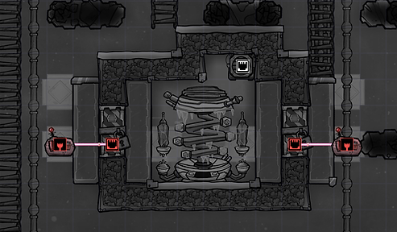
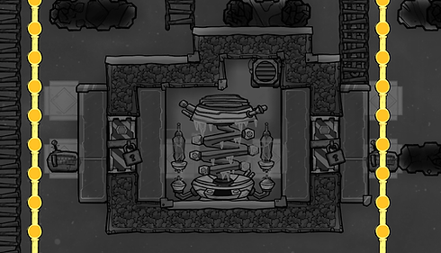
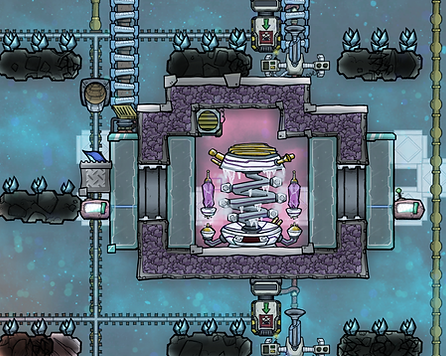
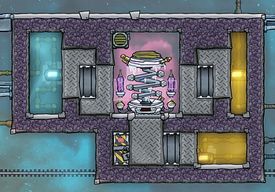
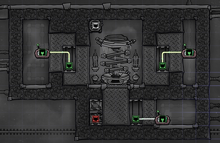
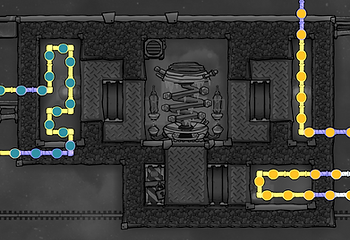
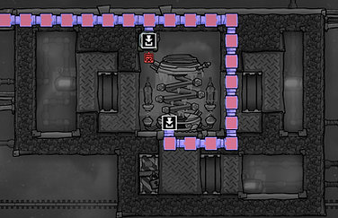

# ANTI ENTROPY THERMO-NULLIFIER COOLING

## Introduction

The anti entropy thermo-nullifier (often called an AETN) can be used to generate huge amounts of chill, and it isn't even that difficult to get the hang of. So let's do just that.

Anti entropy thermo-nullifier

Anti entropy thermo-nullifier (AETN) basics:

* It uses hydrogen (10 g/s)
* It has a gas input pipe for hydrogen
* It generates lots of chill: -80 kDTU/s (whatever that means. But it's a lot)
* The coldest it can get is -173 C, after which it says "too cold"
* It only spawns in the frozen biome

Where the standard challenge with Oxygen Not Included is that things get too hot, the AETN is a refreshing change of pace in that the challenge when using one is that things can very easily get too cold.

The coldest it can get is -173 C, which is about 200 C colder than I like to keep my base. So harnessing an AETN is largely about building a system that only lets out a reasonable amount of chill.

Controlling AETN chill commonly involves some automation. If you haven't done any automating yet, don't worry - it's not hard. You'll just be connecting a door to a sensor. (There's also a separate guide on [Getting started with automation](getting-started-with-automation.md) if you want to dive deeper.)

As with everything else in Oxygen Not Included, there are many ways you can do things. I tend to use two designs, one version for cooling either SPOM oxygen output or the liquid in a cooling loop. The second version for cooling sleet wheat farms. (But you can of course use the same designs to cool whatever.)

Both approaches use the same control mechanism. Let's cover that first, then some pictures and overlays of the builds.

## The control mechanism

Mechanized airlock

The basic idea is to have a way to decide when the AETN can spread its chill. This is done by having an area between the AETN and its surroundings that we can change between allowing temperature transfer and not allowing it.

More specifically, we'll use a kind of door called a mechanized airlock. It is unlocked by researching Decontamination in the Gases branch of the research tree.

By enclosing the door so there are tiles on both sides, we can alternate between allowing and not allowing temperature transfer. When the door is closed temperature transfer can happen, when the door is open that area is a vacuum and temperature transfer won't happen.

Then we add some temperature-related automation: a thermo sensor which we connect to the door. The thermo sensor is unlocked in HVAC in the Gases branch of the reserach tree.

The door will work regardless of whether you power it. Without power it will constantly show a "no power" icon. So to power it or nor is mainly about how bothered you are by that icon.

To chill or not to chill. The thermo sensor is connected to the mechanized airlock and opens and closes the door based on the temperature in its surroundings.

## Some thoughts (and stats) on build materials

Creating a vacuum.

How effective this design is at allowing temperature transfer between the two sides of the door will depend on what materials you build things out of.

The goal should be to get access to steel before you build this. (There is a separate guide for [getting steel](getting-steel.md).) The reason for that is that doors made out of the metals you have access to at the start of the game have very bad thermal conductivity.

The difference between materials is significant. Here are the thermal conductivity stats for a mechanized airlock depending on what it is made of:

Mechanized airlock thermal conductivity:

* Steel: 54
* Wolframite: 15
* Copper: 4.5
* Iron: 4
* Cobalt: 4
* Gold: 2

(If you build it out of thermium it will have a thermal conductivity of 220. But if you have access to thermium you should be writing beginners' guides not reading them, you silly gamer you!)

Then for the tiles on the sides of the door, the same thing goes: use a material with as good a thermal conductivity as you can get your hands on. Here are some tile stats:

Metal and window tile thermal conductivity:

* Aluminum: 220
* Cobalt: 100
* Diamond: 80
* Copper: 60
* Gold: 60
* Iron 55
* Steel 54
* (Glass: 1,1)

Note that while steel is great for the door, it isn't that great for the tiles around it. Also note the difference between diamond (good) and glass (garbage).

Another question is what gas to have in the AETN room. Here, too, there are differences.

Thermal conductivity of common gases:

* Hydrogen: 0,168
* Oxygen: 0,024
* Chlorine: 0,008

You don't need to remember these figures, just keep in mind that hydrogen is the best option for the AETN and use it if you can be bothered.

Filling the AETN room with hydrogen is quite simple to do when you get the hang of it. You start by building the AETN room but leaving a way in on one side. Then you build a temporary [liquid lock](liquid-lock-basics.md) leading to that entrance. Then vacuum out the gases in the AETN room. Build a gas vent inside the AETN room, hooked up to the hydrogen piping. When the room is in a vacuum, build the missing section of the wall.

A way to improve temperature transfer is to add some tempshift plates. They are unlocked in Refined Renovations in the Solid Material branch of the research tree.

Tempshift plate

Tempshift plate basics:

* Tempshift plates aid temperature transfer between the tile they are on and all tiles around them, including diagonally.

Here, too, what material you choose matters.

Tempshift plate thermal conductivity:

Aluminum: 205

Cobalt: 100

Diamond: 80

Copper, Gold: 60

Iron: 55

Not that the metals above are refined metals, not ores. Unrefined metals have bad thermal conductivity. By way of example, a tempshift plate out of copper ore has a thermal conductivity of 4.5 and one of gold amalgam has a thermal conductivity of just 2.

In conclusion

This section had an absolutely silly amount of numbers and stats. The idea isn't to remember them, but just to remember roughly what materials are better than others. For instance, if you have access to aluminum it is probably your best choice. If you don't have it, diamond. (Or cobalt, but maps with cobalt usually also have aluminum.) And so on.

But also: you don't need to be too worried about min-maxing everything. Just try to not build things out of complete garbage materials and you should be fine :-)

And now some overlays for a couple of variations of an AETN cooling build.

## AETN cooling, version 1

This is a design I picked up from a [Francis John YouTube video](https://www.youtube.com/watch?v=36qR5nAH5qw). It uses the mechanized airlock temperature transfer we covered earlier. The AETN is on one side, on the other is a room (or box?) of polluted water.

Then you would run whatever you wanted to cool, commonly radiant gas or liquid pipes, through that chilled polluted water. (That is not pictured in the overlays below, but please remember to buid it anyway.)

You can use other liquids as well. Polluted water is a decent choice, and has a lower freezing point than water: -20.6 for polluted water compared with -0.6 for water. (Though I'm not sure it matters much if the liquid freezes.)

Liquid or gas pipe cooling. The actual cooling takes place in the area with polluted water on the right. Not pictured here is that you would have radiant liquid or gas pipes running through that area to be cooled.

Automation overlay

Ventilation overlay. The gas bridge isn't important, you can also just have the hydrogen split 50-50 between the pipes. (An AETN doesn't use that much hydrogen.)

If the AETN is generating enough chill (meaning if you aren't trying to cool something down too much) then you can also double-dip: have both gas and liquid pipes run through to be cooled.

On a planet (or planetoid) where you don't have a lot of dupes, you can use an AETN to cool both a SPOM and its output.

AETN double-dipping. The SPOM is cooled by a liquid cooling loop, the SPOM's oxygen is cooled with gas piping. Both pass through the AETN's cooling area.

## AETN cooling, version 2

This, or some variation of it, is what I use for cooling sleet wheat farms.

The temperature can fluctuate more in this design than the previous one, and the area outside the AETN can become colder than your settings. Which is worth keeping in mind when designing your cooling loop and choosing your liquid. (More on that after the pics.)

Sleet wheat farm cooling loop. The thermo sensors by the diamond walls signal when to open and close the doors. Diamond tempshift plates both inside the AETN room and outside help with temperature transfer.

Ventilation overlay. The most important part is pumping hydrogen to the AETN. Hydrogen has better cooling stats (specific heat capacity and thermal conductivity) than other gases, so consider filling the AETN room with it.

Automation overlay. A thermo sensor is connected to a mechanized airlock. When closed, chill can spread. When open, the area is a vacuum and doesn't spread chill. (The doors can be powered if you want, but don't need to be - they just open and close a bit more slowly without power.)

Plumbing overlay. A cooling loop (with petroleum) passes by, spreading the chill from the AETN around the sleet wheat farm. Diamond temp shift plates help with temperature transfer.

When choosing a liquid to use in your cooling loop, remember to check what temperature it freezes at. (You can also start out with an easy one like polluted water and upgrade when you get access to something better.)

Liquid freeze points (in Celsius):

* Super coolant: -271.2
* Ethanol: -114.1
* Petroleum: -57.1
* Oil: -40.1
* Polluted water: -20.6
* Water: -0.6

Sleet wheat grows at +5 C or below, so that's (at least) what you need to aim for. But a benefit to keeping your farm at freezing temperatures, more specifically at below -18 C, is that it prolongs the freshness of any harvested sleet wheat. Or, rather, it slows its decline in freshness.

The freshness decline of foods is affected by temperature and atmosphere. When sleet wheat is in "deep freeze" (which is at below -18C), there is no freshness decline from temperature.

Sleet wheat freshness decline will still be affected by atmosphere. If kept in oxygen there is a 2% decrease in freshness per cycle. To get that down to zero you will need to store it in an atmosphere considered "sterile." These are: carbon dioxide, chlorine, hydrogen, and vacuum.

I turn my sleet wheat into berry sludge, the lazy gamer's dream meal: it doesn't spoil. So I don't worry so much (or at all) about getting freshness decline down to 0%.

If you want to be able to store food without spoiling, you'll need a freezing area (it can be a very small area) that is in a sterile gas. You can find guides for such designs online.

Not zero Kelvin but pretty cool. A metal tile, chilled by the AETN, serves as freezer and storage for excess sleet wheat while waiting to be turned into berry sludge.

## Moar cooling(!)

You can hook up several cooling loops to the same AETN. The main limitation is how much chill you need - how much you need to cool things down.

The pics below are of a build where three cooling loops are chilled by the same AETN. (I also have a door built for a fourth cooling loop, should I need it. Bottom left.)

---

*Archived from [https://www.guidesnotincluded.com/anti-entropy-thermo-nullifier-cooling](https://www.guidesnotincluded.com/anti-entropy-thermo-nullifier-cooling) ([Wayback Machine snapshot](https://web.archive.org/web/20250822031650id_/https://www.guidesnotincluded.com/anti-entropy-thermo-nullifier-cooling)). Original work © Some Random Finn / guidesnotincluded.com, licensed [CC BY-NC-SA 4.0](https://creativecommons.org/licenses/by-nc-sa/4.0/). Reformatted from HTML to Markdown for this non-commercial community archive — see [Attribution & licensing](attribution.md).*
