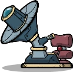
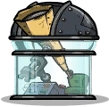
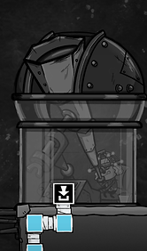

# GETTING TO SPACE (DLC)

## Introduction

Managing your dupe space program can be divided into three categories:

1. Discovering places to go
2. Building a rocket that can take you there
3. Not dying on the the way

Let's take a closer look at each category.

## Discovery

The Telescope (found under Rocketry)

The Enclosed Telescope (found under Rocketry)

The Enclosed Telescope requires oxygen (and power)

You can see a map of space by clicking on Starmap in the top right (or press Z).

Space is divided into a bunch of hexagonal tiles (which is just a fancy way of saying "tiles with six sides").

To be able to send a rocket somewhere, you need to have discovered that "somewhere" first.

The tiles nearest your starting asteroid are discovered from the start of the game. Beyond those tiles is a band of dark blue tiles, and beyond them the tiles are black.

One significant difference between the two (dark blue and black tile) is that in the dark blue tiles the game will tell you if there is something of interest. This will show up as a question mark (?).

To see what the question marks are, you need to have a dupe look examine the tile using a Telescope.

There are two kinds of telescope: the basic telescope and the enclosed telescope. Both telescopes need power, the enclosed telescope also needs oxygen pumped to its gas input.

Telescope use requires a dupe to have the Astronomy skill, which is found in the "research" branch of the skill tree.

To begin discovering new parts of space, simply build a telescope on the surface of your asteroid and a dupe will start using it.

Telescopes need to have a clear view of the sky to function properly. (There are exceptions to this. More on that later.)

Both the standard and enclosed telescopes accomplish the same thing. The difference is that the enclosed one will have oxygen, so you can have a dupe use it even without an atmo suit.

(You can have a dupe use the basic telescope without an atmo suit also. It will just be slower, as they will have to run into the base whenever they need oxygen.)

Dupes will study one tile at a time. If you open the starmap (and zoom in a bit) you can see what tile they are working on and how it is progressing.

Studying a tile with a question mark will show you what object is there. There are both asteroids as well as other things to be found out in space.

Unlike in the base game, in the Spaced Out DLC you cannot examine all of space from your starting asteroid. When the telescope has examined everything it can (which is a few tiles out in all directions), mousing over the telescope will show the text "Area Complete." (You can then deconstruct the telescope if you want, you won't need it anymore.)

Now that you know there is "stuff" out in space, it's time to head out for a closer look!

## Rockets, engines and fuel

The Rocket Platform (select the platform to build a rocket on it)

Carbon Dioxide Engine

Carbon dioxide is fed to the carbon dioxide engine. (Optional: pumping oxygen into the spacefarer module.)

To build a rocket, you first need to build a Rocket Platform, found under Rocketry.

(Rocket platforms don't need to be built on a "floor" or foundation of other tiles, they can also just kind of float.)

Once you have a rocket platform built, you can click on it and select "new rocket." This will open a list of the different kinds of rocket modules you can build, among them rocket engines. The engine is also the first thing you will build to get your rocket construction going.

How tall a rocket you can build, and how far it can travel, is determined by the rocket's engine.

You can mouseover the different engines to get more information about them. Two important bits of information are: what they use as fuel (which will be clear from the name of the engine) and what their maximum height is.

Taller height restrictions require more advanced kinds of fuel. At the start of the game you won't have access to more advanced fuel.

One important aspect of your early rocketry program is generating data banks for research.

The less advanced engines are limiting both in how large rockets you can build (height restrictions) as well as in how far they can travel.

For my first rocket I usually use a carbon dioxide engine. It uses surprisingly little carbon dioxide. If you have any lying about at the bottom of your map that will probably be enough. (If you will be doing several lDig a little carbon dioxide pit that goes lower than your carbon skimmer.

In addition to an engine you will also need somewhere for your dupe (or dupes) to be. There are two options: the Solo Spacefarer Nosecone and the Spacefarer Module. The main difference between them is their size.

The Spacefarer Module is unlocked through research. It is found in Durable Life Support in the Colony Development research branch.

The solo spacefarer nosecone is very small, so I recommend you make unlocking the larger spacefarer module a priority. (The small one is so small that I no longer bother with it - I unlock the larger module before building my first rocket.)

Unlocking the Spacefarer Module requires doing a bit of the kind of research that requires radbolts. (But don't be intimidated by this - there is [a separate guide](spaced-out-research-guide.md) for how to do radbolt research.)

The height restrictions for the early engines are so limiting that there won't be a lot of space for extra modules on your first rocket. One option is to have some solar panel modules to help with power generation. (Or a battery to store power.)

You will need to discover a place to go. You will need to build and fuel a rocket that can take you there. And you will hopefully also be able to keep your dupes alive during the trip.

Oxygen Not Included isn't just a game, it's a solemn pact. You promise to do everything in your power to give your dupes a good existence. In exchange, they promise to do everything in their power to accidentally kill themselves in utterly baffling and completely avoidable ways.

Boldly going where no dupe has gone before requires a few different things.

Space offers new, exciting opportunities for such death. Like the time I saw an alert that a dupe had died. They had suffocated in a rocket. Next to their dead body was an oxygen diffuser (the machine that turns algae into oxygen). And next to the oxygen diffuser was a storage bin full of algae.

It turned out I hadn't raised the priority for filling the oxygen diffuser with algae. So the dupe had done other things while they slowly used up all the oxygen.

OK, that one was kind of on me. But the point is: in space things can go wrong in ways that you can't fix. Like running out of food or oxygen while you are so far away form home that you cannot save them.

This stuff is easier to secure when you are a bit further along. Specifically, when you have berry sludge (a food that doesn't spoil). Oxylite is also helpful. Then you can have dupes spend however long you want in rockets.

## Surviving the journey

Oxygen, carbon dioxide and food

---

*Archived from [https://www.guidesnotincluded.com/copy-of-getting-more-water](https://www.guidesnotincluded.com/copy-of-getting-more-water) ([Wayback Machine snapshot](https://web.archive.org/web/20221129152932id_/https://www.guidesnotincluded.com/copy-of-getting-more-water)). Original work © Some Random Finn / guidesnotincluded.com, licensed [CC BY-NC-SA 4.0](https://creativecommons.org/licenses/by-nc-sa/4.0/). Reformatted from HTML to Markdown for this non-commercial community archive — see [Attribution & licensing](attribution.md).*
