# GETTING OIL, PETROLEUM, AND PLASTIC

## Oil and the oil biome

If you are on Terra (the standard starting asteroid in the base game and "Classic" option of Spaced Out), finding oil is easy: dig down and you will eventually reach the oil biome. (Terrania, the standard small starting biome in Spaced Out, does not have an oil biome.)

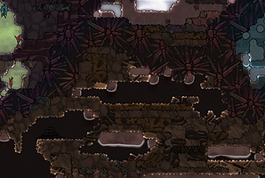

The Oil Biome. Usually found at the bottom of the map, but varies depending on asteroid. (And not all asteroids have an oil biome.)

Triage Cot

Some things to keep in mind:

* The oil biome is hot. So use [Atmo Suits](atmo-suit-basics.md).

  + In hot surroundings (mid-70C and above) dupes will start taking damage and then become incapacitated, needing saving by another dupe.

* Oil in a hot biome is hot. So build pumps and pitcher pumps out of materials that can handle it. For instance:

  + Gold amalgam for pumps
  + Ceramic for pitcher pumps. (Ceramic is made with a Kiln, found under Refinement.)

There will most likely be pools of oil waiting for you in the oil biome. How much varies between maps: either enough to get you started or enough to last thousands of cycles. If and when you need more oil, you can tap into an Oil Reservoir. (Covered below.)

When pumping oil out of the oil biome, remember to use Insulated Pipes if you want to minimize temperature exchange with the surrounding area.

If you want to stop gases from mixing between the oil biome and the rest of your base, you can put a [liquid lock](liquid-lock-basics.md) by the entrance to the oil biome. If you also want to stop temperatures from mixing, you can put two liquid locks next to one another and then use a gas pump to create a vacuum in the space between them.

Getting there without Atmo-Suits?

Maybe you're in a hurry. Or are lazy. Or don't have have access to Reed Fiber. For whatever reason, if you are going to brave the oil biome without suits, there are some quick & dirty tips to keep in mind. (Not that I have ever sent my dupes into dangerously hot environments without suits, of course.)

* Make sure to first build at least one Triage Cot (a hospital bed - found under Medicine). Incapacitated dupes can be carried there for treatment.
* Try to find a (relatively) cool section - look for temperatures in the low 70s or below.
* Look for an area where an ice biome (or other cold biome) meets the oil biome. Dig out the abysselite between them, and maybe even some ice or other cold tiles above the abysselite brake so the materials fall into the oil biome and speed up the cooling of a small area.

## Oil Reservoirs and Oil Wells

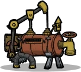

Oil Well

You can tap into an Oil Reservoir by building an Oil Well on top of it. This allows you to extract oil. ("Crude oil" to be precise. But I'll just call it oil.)

Oil Well basics:

* The Oil Well is unlocked through research (Plastic Manufacturing in the Power research branch)
* Requires power (240W)
* Needs to be supplied with water (1kg/s)
* Produces crude oil (333g/s) which is released into the environment
* Produces natural gas (33g/s) which is stored in the oil well until released (into the environment) by a dupe

As the amount of natural gas stored in the oil well grows, its so-called backpressure builds. There is a red meter on the oil well that shows its backpressure level. This pressure needs to be released by a dupe or the oil well will eventually stop working. (According to the Wiki, at 100% backpressure it will store 80kg of natural gas.)

By clicking on the oil well you can adjust the backpressure release threshold - at what backpressure level dupes should come release the pressure.

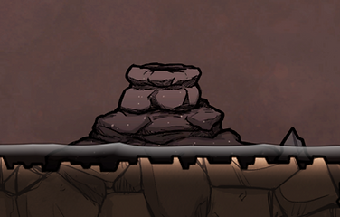

Above: Oil Reservoir.

Below: Oil Reservoir with an Oil Well built on it

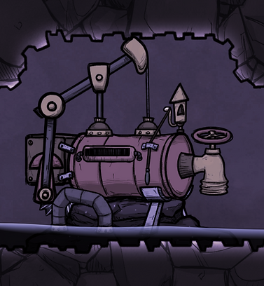

Oil wells generate heat. Releasing the backpressure of an oil well generates a lot of heat. So much heat that it can damage the water pipes supplying the oil well. This happens through something called state change - the water turns to steam in the pipes, damaging them in the process. There are various things you can do to minimize the risk of this happening.

Oil Wells can function even when submerged in liquid. This can be used to your advantage by having a tile or two of oil that can help keep temperatures from spiking.

A Tempshift Plate (or two) will also help distribute heat and even out heat spikes. Tempshift plates even out temperatures between their tile and the eight tiles that surround them. You can place a tempshift plate on the tile with the oil well's nozzle and, if you want to be extra cautious, another one two tiles to the left.

Tempshift Plate

Hydro Sensor

If you build a room for your Oil Well (rather than having it just release oil and natural gas into the oil biome) you will need a Gas Pump to pump out excess natural gas (or the gas pressure will rise so high it will damage your tiles). But you can also use this gas to help absorb heat spikes, so keep the gas pressure in the room high. Use an Atmo Sensor to automate the process. (You can set it to the maximum pressure it allows: 20000g.)

Even with all that, it will be hot around the oil well. Any dupe that comes to release its backpressure will be scalded unless they are wearing an [atmo suit](atmo-suit-basics.md).

The action of releasing backpressure falls under the duplicant skill Operating. The quicker a dupe releases the pressure, the smaller the risk of pipes taking damage. One possible approach to this is to block entry to the oil well for all but dupes with a decent operating skill. (This can be done by adding a door and modifying door permissions.)

With some simple automation you can have your oil well turn off when you have a specified amount of oil stored. For instance, if your oil pours into a storage pit of some kind you can place a Hydro Sensor in the pit and have it send a red signal when you have enough oil.

An easy way to do this is to connect your hydro sensor directly to your oil well (using automation wire). Alternatively, you can use the hydro sensor to regulate your water flow to the oil well. You can hook up the hydro sensor to a liquid shutoff that stops the water flow to the oil well, or connect the hydro sensor directly to your water pump.

A popular oil well setup, by Francis John, is included in the Builds section of this site: [Oil well with liquid lock](oil-well-with-liquid-lock.md). (An almost identical version is pictured below.)

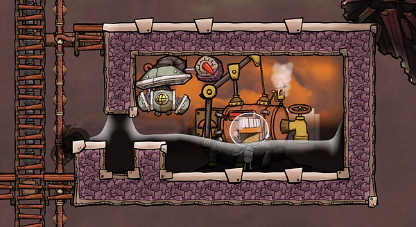

Nails... I do love your zest for getting things done. But you're the chef. In a colony that includes four dupes specialized in operating. All of whom have their operating priority raised. Which, not to belabor the point, you do not. (Still, thanks.)

## Petroleum

Oil Refinery

When you have gotten your hands on oil you can turn it into petroleum using a building called an Oil Refinery (found under Refinement).

Oil Refinery basics:

* Turns oil into petroleum
* Has an input pipe for oil and an output pipe for petroleum
* Also produces natural gas, released into its surroundings
* Requires power (480W)
* Requires a dupe to run the machine

When converting oil to petroleum in a refinery you will lose half of your mass: it inputs 10kg/s of oil and outputs 5kg/s of petroleum.

Note: You can turn oil into petroleum with 100% efficiency by heating up the oil to just over 400C. Then, whatever amount of oil you heat up will become that same amount of petroleum. (You can find designs for such setups online. Search for "petroleum boiler.")

My standard oil refinery room looks something like this:

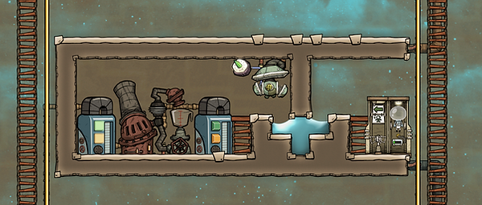

The liquid reservoir on the left stores extra oil. This smooths out the refinement process by making sure there is always oil available for the refinery. (If your refinery is fed directly by a liquid pump in the oil biome there can be sporadic shortages in the refinery's oil supply.) The liquid reservoir on the right stores petroleum.

An oil refinery will stop working if the gas pressure surrounding it gets too high, as that prevents it from outputting natural gas into its surroundings.

When building the room pictured above, pump out all the oxygen (etc.) before firing up the oil refinery. Then you will only have natural gas in the room. And then build somewhere to pump the natural gas.

If your natural gas pipe backs up, your oil refinery will stall. So whatever you decide to do with your natural gas, it's a good idea to also have an overflow mechanism for it. (Like sending overflow to a natural gas generator or venting it to space - just get it out of the room.)

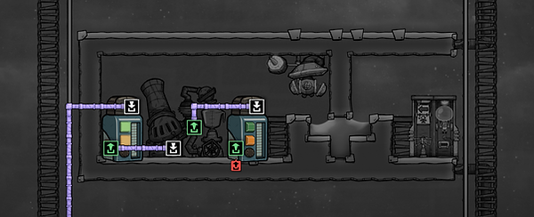

This room design only has one atmo suit. Meaning only one dupe will be able to enter the room at a time. Normally that is enough, the exception being if you want to do any construction in the room - like adding a cooling loop. You can add a second atmo suit dock by removing the ladder in the oil refinery room and moving everything over one tile to the left.

Instead of a second atmo suit dock, I usually add an on/off switch (a Signal Switch, found under Automation) to the oil refinery. Then, if I want to do any construction in the room I turn off the refinery, freeing up the atmo suit for the dupe doing the construciton.

(I also usually don't have the ladder in the refinery room and instead move the petroleum liquid reservoir one tile to the right. This frees up one tile of space for a decor item next to the Oil Refinery.)

Plastic

## Plastic

There are two ways to get plastic: by shearing Glossy Dreckos or by refining petroleum.

My personal preference is using glossy dreckos for my plastic production. I usually have one or two glossy drecko ranches and they produce more than enough plastic for all my needs. This approach to plastic is covered earlier in the guide, [Low-tech plastic: drecko ranching](low-tech-plastic-drecko-ranching.md).

Now let's move on to the other approach: getting plastic by refining petroleum.

Just like we got petroleum by sending oil through a machine, we get plastic by sending petroleum through a machine. But this machine, the Polymer Press, doesn't require dupe interaction.

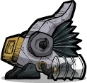

Polymer Press

Polymer Press basics:

* Converts Petroleum into Plastic
* Also produces carbon dioxide, steam, and heat
* Requires power (240W)
* Has in input pipe for petroleum
* Has an output pipe for carbon dioxide
* The steam is released into its surroundings
* The plastic is dropped in front of the machine, under the yellow bit.

Note: This machine runs hot. And produces hot steam. And produces hot carbon dioxide. So build it out of gold amalgam if you have access to it. Also, unless the polymer press is in a very hot room, the steam will turn to water - worth bearing in mind when placing it.

If you have problems with overheating, a temporary fix is to build a Tempshift Plate out of ice by the Polymer Press.

Without a carbon dioxide output gas pipe the Polymer Press won't function. If you want to put the carbon dioxide to use you can feed it to Slicksters (found in the oil biome) or power a carbon dioxide rocket engine with it (if you have the Spaced Out DLC). I tend to just vent it nearby until I get around to building a gas pipe that vents it into space.

Since the polymer press requires petroleum, I usually place it near my oil refinery.

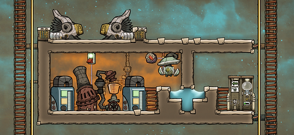

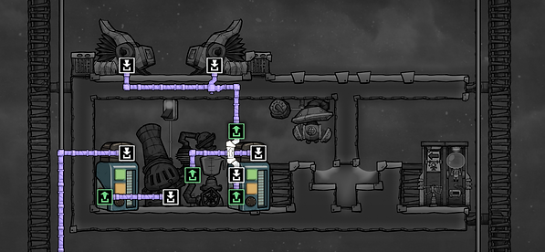

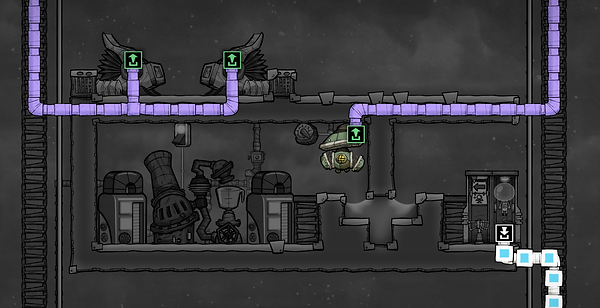

I usually add an Auto-Sweeper and a Smart Storage Bin. Then I connect the storage bin to a Not Gate and then to the Polymer Presses.

This allows you to set whatever amount of plastic you want to keep in supply, and the Polymer Presses will stop once you have that amount in the storage bin. (In the storage bin, plastic is found under Manufactured Material. But it will only show up once you actually have some plastic.)

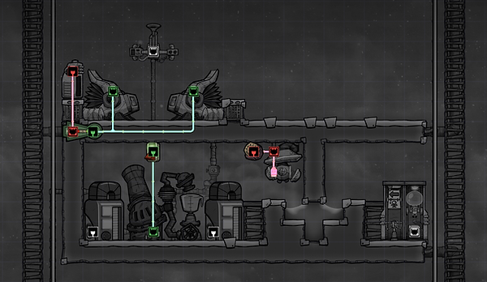

I tend to leave a space between the Polymer Presses for a small liquid pump. But so far I've never had so much water pool there that I would have needed one.

Some water tends to pool under the presses (steam that has cooled down), causing a debuff from stepping in it. To avoid the debuff you can block access to the smart storage bin from the the "other side" (in the above picture that would mean blocking access from the right) by placing a door or additional airflow tile to the right of the polymer presses.

Not included in the above pictures is cooling. My standard solution is a cooling loop that runs through the area. (We'll cover cooling once we've covered getting hold of steel.)

---

*Archived from [https://www.guidesnotincluded.com/getting-oil-petroleum-and-plastic](https://www.guidesnotincluded.com/getting-oil-petroleum-and-plastic) ([Wayback Machine snapshot](https://web.archive.org/web/20250827233034id_/https://www.guidesnotincluded.com/getting-oil-petroleum-and-plastic)). Original work © Some Random Finn / guidesnotincluded.com, licensed [CC BY-NC-SA 4.0](https://creativecommons.org/licenses/by-nc-sa/4.0/). Reformatted from HTML to Markdown for this non-commercial community archive — see [Attribution & licensing](attribution.md).*
