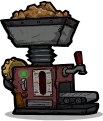
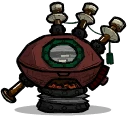
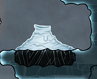
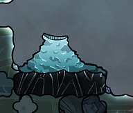
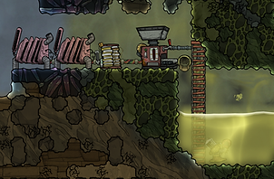
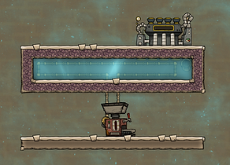
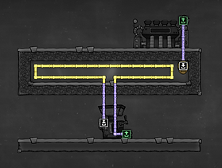
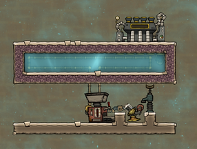
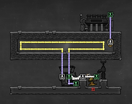

# GETTING STEEL

Metal refinery

Kiln

Steel is made using a Metal Refinery.

Metal refinery basics:

* It is unlocked through research (Smelting)
* Once unlocked it is found under Refinement
* It has liquid input and output slots
* It requires a whopping 1,2Kw of power

For reference, 1,2Kw is the amount of power produced by two coal generators or three hamster wheels. Remember that regular wire can only handle 1Kw, so you'll need conductive or heavi-watt wire

Making steel requires Iron, Refined Carbon, and Lime

* Iron can be refined from iron ore using a metal refinery or a rock crusher (iron can also be found on some maps)
* Refined carbon is made from coal using a Kiln (found under refinement).
* Lime is made with a rock crusher. Different materials can produce lime: fossil, egg shells, and pokeshell molts. (Fossil can be found in the [oil biome](getting-oil-petroleum-and-plastic.md).)

The metal refinery needs a steady supply of liquid for it to function. This liquid is used as coolant - it comes out hotter than it went in. (How much hotter depends on what metal you are refining.)

Dealing with coolant is the main challenge with running a metal refinery. There are different ways you can solve it. One standard approach (and what I usually do) is to reuse the same liquid, but cool it down in-between uses. We'll cover that soon. But first an easier approach: cool liquid geysers.

Cool liquid geysers

If you have either a cool slush geyser or a cool salt slush geyser then you can use that liquid as coolant. The first asteroid in Spaced Out should have them. (The small asteroid, not "classic.")

(Note: this does not work with a normal salt geyser - it outputs very hot liquid.)

Cool Salt Slush Geyser

Cool Slush Geyser

The liquid from these geysers is so cold (-10C) that even after being run through a metal refinery it will still be cool enough to add to your water supply.

(If it is a cool slush geyser, run it through a water sieve on its way to your water tank. If it is a cool salt slush geyser run it through a desalinator.)

A temporary setup. Don't overthink it. A couple of coal generators and a battery. Heavi-watt wire all the way. Make your batch of steel and be done with it.

Temporary setup

A temporary setup can be done with any somewhat large body of water. (Try to avoid your fresh water, though - check other biomes instead.)

Simply build a liquid pump in a body of water, pump it to your metal refinery, and then have it output back into the same body of water. It will start heating up the pool of water, but you will be able to make some steel before heat becomes a serious problem.

If you are planning on making a lot of steel, go straight for a permanenet setup. (There is rarely a need for a temporary setup.)

A permanent setup

You can reuse the same coolant by cooling it down between uses.

This can be done by having the coolant run through a body of water - through radiant liquid pipes to help the heat transfer. As it runs through the water, it transfers heat to the water and cools itself down in the process.

The body of water it runs through will heat up and eventually boil, turning to steam. This is where a steam turbine comes in. You can place a steam turbine over the body of water. It will then turn some of the heat into energy. In the process some of the steam will be turned back into (hot) water. This can be dumped back into the body of water.

(To make a steam turbine you will need some [plastic](getting-oil-petroleum-and-plastic.md).)

This setup is probably a lot easier to grasp as a picture than my confusing explanations. Here:

The water tank doesn't need to be as large as in the picture above, but make it too small - and use your metal refinery too frequently - and you can get pipe damage from overheating. So too big is better than too small.

This design can be paired with a cooling loop, in which case you would also put a thermo aquatuner in the pool of water. I will cover that later in the guide, but you can see pics of it in the [builds section](aquatuner-steam-turbine-cooling-loo.md). A cooling loop is also included in the [mini industry](mini-industry.md) section of the guide (a layout for cramming in a lot of machines in a small space.)

Regarding coolant

Whatever you use as coolant will get hot. So for your coolant you need a liquid that can handle getting hot. Water would boil. Use oil (petroleum works as well.) You can find oil in the [oil biome](getting-oil-petroleum-and-plastic.md).

The metal refinery needs 400kg of coolant. However, it has a tank that can hold additional coolant. To enable the metal refinery to run non-stop and not have to wait for coolant to fill up, you should fill it with at least twice that amont (800-1200kg).

To fill the metal refinery with coolant you can simply build a temporary setup with a liquid pump and a bottle emptier, and have the pump connect to the metal refinery's piping.

Planning on including a cooling loop?

If you are planning on including a cooling loop in this design (which is a very common idea and something I do myself) then you will need 1200kg of steel for the thermo aquatuner.

Unless your water tank is very small, you will be able to make 1200kg of steel without the water getting to boiling point (or even scalding). Meaning you can refine your steel before enclosing your water tank completely, then add the thermo aquatuner and close up the design once you have your steel.

---

*Archived from [https://www.guidesnotincluded.com/getting-steel](https://www.guidesnotincluded.com/getting-steel) ([Wayback Machine snapshot](https://web.archive.org/web/20250819122246id_/https://www.guidesnotincluded.com/getting-steel)). Original work © Some Random Finn / guidesnotincluded.com, licensed [CC BY-NC-SA 4.0](https://creativecommons.org/licenses/by-nc-sa/4.0/). Reformatted from HTML to Markdown for this non-commercial community archive — see [Attribution & licensing](attribution.md).*
