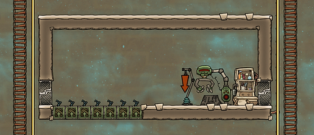
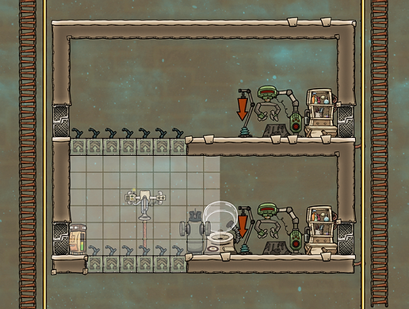
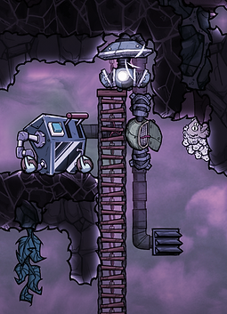
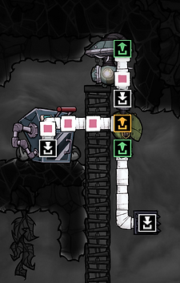
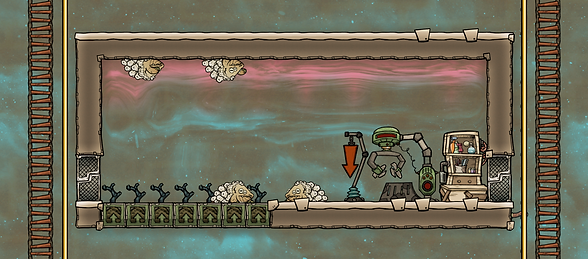
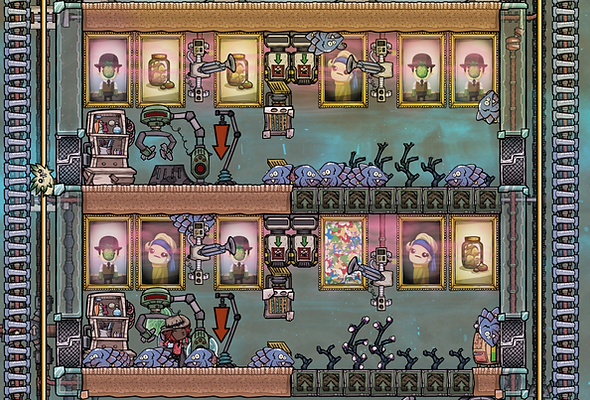
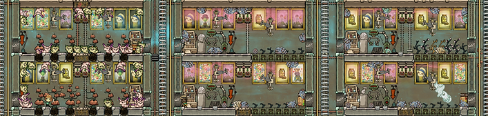

Drecko

Glossy Drecko

Shearing station

Ranching basics are covered [earlier in this guide](ranching-basics.md). This part is specifically about drecko ranching for plastic.

There are two kinds of dreckos: regular and glossy. Both can be sheared using a Shearing Station (unlocked through researching Ranching, then found under stations).

When sheared:

* Dreckos drop reed fiber
* Glossy Dreckos drop plastic

On using the shearing station: you don't have to do anything. If you have a ranch with a drecko in it that can be sheared, then your rancher will take care of it automatically. You can click on a drecko to check how far along their scale growth is. (They can look ready to be sheared even when they aren't.)

A Glossy Drecko ranch is a low-tech option for a steady supply of both plastic and meat.

Dreckos have a slight chance of laying Glossy Drecko eggs. (To see the exact percentage, click on a drecko and see "Egg Chances.") You can increase the likelihood of their laying a Glossy Drecko egg by feeding them Mealwood.

So the low-tech approach to plastic is simply: set up a Drecko farm and feed them Mealwood. Sooner or later you will start getting Glossy Drecko eggs. Then either let them hatch naturally or speed up the process by putting them in a (power-hungry) incubator.

Note: Getting from feeding your first Dreckos Mealwood to shearing your first plastic can take dozens of cycles.

Another note: Too many critters in a ranch causes a "cramped" debuff, meaning they won't lay new eggs. Eggs also count towards that amount. A 96 tile ranch can support 8 dreckos/eggs. So check back with the ranch periodically and remove any (unwanted) eggs.

A basic Drecko mealwood ranch

Mealwood requires fertilizing with dirt (10kg/cycle). You can save some Dupe travel time by adding a storage bin for dirt. (You can also automate all kinds of things in a ranch, but I won't go into that in this section.)

Various additions and improvements. A storage bin for dirt, an Auto-Sweeper (it can actually reach both the upper and lower Mealwood tiles), and an Incubator that can speed up Glossy Drecko egg hatching. There is also a Canister Emptier (middle-left) for adding hydrogen (covered next).

A Drecko's scales only grow if it is in hydrogen. To make sure we keep getting more (and more) plastic from our Glossy Dreckos, we need to add hydrogen to the ranch. This can be done in a few different ways:

The simplest way, and something that I only recently learned from the forums (and I should have written down who suggested it so I could credit them) is to simply build an electrolyzer in your stable. Feed it water and power, then let it run for a while and presto - there's your hydrogen!

Another option is to bring hydrogen to your stable  You can pump it directly from the environment to your ranch or you can pump it into a Canister Filler and then use a Canister Emptier to empty it into your ranch.

To fill a canister with hydrogen, simply build a pump in hydrogen and pump it into a Canister Filler. (The gas filter is optional.)

The goal isn't to fill the whole ranch - just filling the top tile with hydrogen is enough. That way, whenever dreckos move (walk? crawl?) along the ceiling, their scales will regrow.

Up and running. Over time this ranch will fill with Glossy Dreckos. (Raise the priority of the shearing station if you want to make sure they are sheared as soon as possible.)

The main thing that can go wrong with this ranch is that it heats up to 30C or above, at which point the Mealwood will stop growing.

A short-term solution is to build a tempshift plate (found under Utilities) made of ice above the Mealwood. It will melt and cool water will spill over them. (Then repeat as needed.) A long-term solution is to run a [cooling loop](thermo-aquatuner-steam-turbine-cooling-loop.md) past the Mealwood.

Finally, a picture of a (fairly complete) plastic ranch. There have been some small changes to the game since then. The critter drop-off looks different, and there is a castle-like thing you can add for a happiness buff for critters. However, the basic idea is still the same as in the pic.

The one upgrade not shown here, that I usually do at some point, is to swap the storage bin (containing dirt for the mealwood) for a conveyor receptacle. Then have a conveyor loader in a more central location where dupes can keep it stocked.

The airflow tile in the middle (for the deodorizer) makes the ranch size one below its maximum size, which means it can fit one fewer critter before they get the "cramped" debuff. I usually remove the tile and deodorizer once the air is purified. The auto-sweepers then tend to make sure the air stays clean by keeping the floor empty of dropped mealwood etc.

There is a somewhat silly amount of decor, but why not? Carpets are completely overpowered as far as decor goes. Note that carpets are slower to walk on than other materials. So if you want to optimize for dupe movement speed, use plastic for the floors instead. (Or just normal tiles.)

I don't ranch for meat so I don't remove eggs. You could optimize this ranch by maintaining 7-8 glossy dreckos in the ranch and sending all other eggs to be hatched and "starvation ranched."

I don't do starvation ranching myself (and obviously can't condone mistreatment of dreckos - look at them, they're so cute!) but the idea is simply to ship extra eggs/critters off to a stable where you can harvest resources for as long as they live, without feeding them.

Dirt, plastic, meat, egg shells, lumber, phosphorite. A pip farm is a good addition if you want to have a sustainable source of dirt for your drecko farm.

Mealwood uses dirt. Not a lot: 10 kg per cycle. But if you want to make sure your drecko farm doesn't eat away at your dirt reserves, you can start a pip farm as well.

(But don't worry about it if this feels like too much to take on. I rarely do pip farms, I just wanted to mention it as an option.)

When properly fed, pips produce 20 kg of dirt per cycle. (The pink variant, the cuddle pip, produces less: 12,5 kg.) Meaning if you have half as many pips as you have mealwood (and keep the pips fed) your dirt needs are covered.

Keeping pips fed is easy enough: they eat branches from arbor trees. Arbor trees, when you plant them, require fertilizing (70 kg of polluted water and 10 kg of dirt per cycle). But you can avoid that cost by having pips plant them.

Getting your hands on enough arbor tree seeds can take a while. When a pip rummages in an arbor tree, they can drop seeds. (Seeds can also be found on some maps and through the printing pod.)

The pips don't have to be tame, wild ones produce dirt, too. The issue will be getting hold of enough wild pips. But since both pips and eggs can come up as care packages in the printing pod, over time you can fill a farm with wild pips if you prefer.

For a guide on pip planting, see Nakomaru's excellent post on Klei's forums: [Pip Planting: Everything You Need to Know](https://forums.kleientertainment.com/forums/topic/110299-pip-planting-everything-you-need-to-know/). There's also lots of information about pips on the [wiki](https://oxygennotincluded.fandom.com/wiki/Pip).

---

*Archived from [https://www.guidesnotincluded.com/low-tech-plastic-drecko-ranching](https://www.guidesnotincluded.com/low-tech-plastic-drecko-ranching) ([Wayback Machine snapshot](https://web.archive.org/web/20250826144501id_/https://www.guidesnotincluded.com/low-tech-plastic-drecko-ranching)). Original work © Some Random Finn / guidesnotincluded.com, licensed [CC BY-NC-SA 4.0](https://creativecommons.org/licenses/by-nc-sa/4.0/). Reformatted from HTML to Markdown for this non-commercial community archive — see [Attribution & licensing](attribution.md).*
