Contents:

Introduction

Ranching prerequisites

The stable (and room size)

Wrangling and traps

Wild critters and critter taming

Feeding critters

Critter morphs and egg chances

Eggs, incubators and incubation times

Using pips to plant stuff

Example ranch: hatches

Example ranch: dreckos

## INTRODUCTION

A long (long, long) time ago, back in early (early, early) access, ranching was a necessity(\*). That is no longer the case. So the first thing to say about ranching is that it is useful but optional.

If you're still reading, let's move on to some benefits to ranching.

Ranching is an easy(ish) way to get some useful resources. Or, if we want to be precise, to exchange resources for other resources - you exchange whatever you feed your critters for the resources the critters provide. One common example is feeding hatches rock to get coal.

Critters aren't as fussy about heat as plants are, which is a benefit to relying on meat rather than mealwood or bristle blossoms as a food source.

Barbeque, which is made from meat (using an Electric Grill, found under Food), is also a higher-quality meal than bristle blossoms or mealwood.

Before we move on: I realize this section contains a lot of stuff. Don't be intimidated - ranching doesn't need to be complex or difficult. You can ignore pretty much everything I have written and come back to it as needed. There are some pictures of example ranches at the end of the guide. Including a very simple hatch ranch, which will give you a steady supply of coal (if that's what you're after).

## RANCHING PREREQUISITES

Dupe prerequisites

Ranching requires a dupe with the Critter Ranching skill. To unlock that skill you will first have to unlock Improved Farming, so it takes a while to get a rancher. (To be able to do ranching from the start of the game you will have to have a dupe that starts with the ranching skill. This is possible but uncommon - prepare for a lot of rerolling.)

Research prerequisites

The various ranching-related buildings you will need are all unlocked through research. You will need to unlock at least Ranching, the third tier in the Food research branch.

Animal Control, the fourth tier, is needed for some ranching-related stuff, like incubating or more advanced automation. (But you can get by without it.)

Prerequisites

## THE STABLE (AND ROOM SIZE)

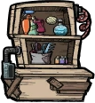

Grooming Station

Before you can get ranching you will need (spoiler alert) a ranch. A room for ranching is (officially) called a stable (but I tend to forget and instead call it a ranch).

The stable, like other rooms, has room requirements:

* It has to have a Grooming Station (found under stations) and/or a Shearing Station (also under Stations)

  + (Commonly you would have at least a grooming station. Having only a shearing station is a special-case scenario regarding dreckos, where you'd mainly want reed fiber or plastic.)
* The room needs to be at least 12 tiles
* The room can be at most 96 tiles

Stable

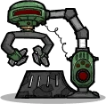

Shearing Station

The size of your stable matters. Critters want a bit of space. If a critter doesn't have enough space it gets a "cramped" debuff. The cramped debuff leads to it not laying any eggs for as long as the debuff is active.

Note: critter eggs also count towards the critter total.

To remove the cramped debuff, simply bring down the number of critters in the stable - for instance by removing some (or all) eggs.

Critters have varying requirements for how much space they want. So the maximum amount of critters you can have in a stable without getting the cramped debuff depends on the type of critter you are ranching.

Hatches and dreckos (both regular and glossy dreckos) require 12 tiles of space per critter. Meaning you can have 8 such critters in a max-sized stable.

You can find a list of critter space requirements on the [Wiki](https://oxygennotincluded.fandom.com/wiki/Stable).

## WRANGLING AND TRAPS: GETTING CRITTERS WHERE YOU WANT THEM

Critter Drop-Off

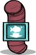

How to move a critter into a stable depends on the critter.

For most critters all that is needed is to select the critter, then select the Move To option, and finally choose where you want to move the critter. A dupe with the ranching skill will then wrangle the critter and move it to where you decided.

Another option is to issue a wrangle command. This can be done by clicking on the Capture Critters icon on the bottom right (the picture of a net) and then clicking and dragging over the critter or critters you want to wrangle. Yet another option is selecting a critter and then clicking on Wrangle.

Some critters cannot be wrangled and instead need to be caught in traps. There are separate traps for land-based critters, airborne critters and for fish. After building a trap, a dupe with the Critter Ranching 1 skill needs to arm the trap before it will work.

Wrangling and traps

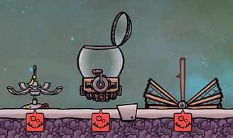

Traps waiting to be armed: airborne critter trap, fish trap, critter trap

Fish Release

Once a critter has been wrangled or caught in a trap, you can use a Critter Drop-Off building (or a Fish Release) to let your dupes know where you want to move it.

Just building a critter drop-off or fish release isn't enough: you also need to select it and define what kinds of critters you want to have brought there.

By selecting the critter drop-off you can also set a maximum amount of critters to be brought to a stable. This is useful for instance if you want to try to avoid critters getting the cramped debuff by dupes bringing too many critters to a ranch.

However, note that the maximum you can set it to is 20. Meaning if there are already 20 (or more) critters in a stable (or area) then dupes won't bring any critters to the drop-off. This is particularly relevant to remember if you have a drop-off in an open area, meaning not in a room. Then all the critters roaming the map (not in rooms) count towards the 20 max critters.

You can use a Critter Pick-Up to manage dupes automatically picking up (wrangling) critters that exceed the set amount for a stable.

You can see how many critters there are in a fish feeder's or critter drop-off's area by mousing over it. If a critter is wrangled but no-one is moving it to a stable, check the critter (or fish) drop-off. There might be too many critters in the area.

You can set the maximum amount of critters in a stable to 8 (or 7 to have a bit of leeway). Then dupes won't bring more critters to that ranch, even if they are wrangled. Note, however, that the critters in the ranch will lay eggs, and the eggs count toward the cramped debuff.

Unfortunately, keeping stables at a steady 7 or 8 critters requires either a lot of manual tinkering or some automation and additional building.

I might cover ranch automation later in the guide, but there are a lot of people who are a lot better at that than I am. So you're probably better off just checking the forums for examples. Search for "automated [critter you want] ranch," or "evolution chamber."

Critter Pick-Up

## WILD CRITTERS AND CRITTER TAMING

Critters can be either wild or tamed. There are up- and downsides to both.

A wild critter can be hungry but cannot starve to death. A tame critter will starve to death if left without food for long enough. (You will get a warning about a critter starving. By selecting the critter you can see how many days are left before it starves to death.)

This is particularly important to keep in mind before taming critters with limited diets, like pips. Make sure you have an arbor tree that is sufficiently grown (meaning it has branches) before you tame a pip, otherwise it may starve to death before a planted tree matures enough.

A wild critter lays eggs that hatch wild critters. Tame critters lay eggs that hatch tame critters. Once tamed, all descendants of a critter will be tame. If you never do any ranching, you will always only have wild critters.

Wild critters lay one egg during their lifetime, meaning the wild critter population of your map remains roughly constant.

Tame critters lay many eggs during their lifetime. (According to the [wiki](https://oxygennotincluded.fandom.com/wiki/Ranching), a tame critter will lay 16 eggs over the course of its life, assuming good conditions: not suffering debuffs like glum or cramped.)

Critters in Oxygen Not Included - even "wild" critters - won't attack you. The only exception is Pokeshells that are guarding an egg. Other creatures, and Pokeshells that aren't guarding eggs, are harmless. (They can be bothersome, certainly. But they won't try to hurt your dupes.)

A wild critter is tamed by grooming it. This is done by a rancher at a grooming station. Grooming gradually reduces the wildness of a critter; going from wild to groomed takes two cycles.

Tamed critters need frequent grooming to stay happy, otherwise they will get a "glum" debuff leading to an 80% decrease in metabolism. Meaning less output of whatever the critter normally, um... poops.

Wild fish are tamed by feeding them. This is done using a fish feeder. Eating form a feeder gives them an "Ate From Feeder" buff: wildness -20%, happiness +2.

Wild & tame

## FEEDING CRITTERS

Feeding critters works a bit differently depending on the critter. For many critters you will use a Critter Feeder. Or, for fish, a Fish Feeder.

Feeding critters

Critter Feeder

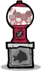

Fish Feeder

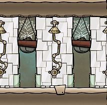

Pre-emptive plant commands that may or may not save Buddy Bud seeds from being eaten by pacu.

Click on the feeder to see a list of the critters it can have food for. Then click to select what kind(s) of food you want to fill it with. Dupes will then fill it up with whatever you selected.

You can save some dupe travel time by having a storage bin set to store the same kind of material/food nearby. So they don't have to go far to fill up the feeder.

Critters can also eat food/resources they come across on the map. And some, like dreckos and glossy dreckos, eat plants that are growing, either wild or planted in a farm tile (but not anything growing in a planter box).

Note that pacu (i.e. fish) like eating algae and seeds that have been dug up and are lying on the ground. If you want to save your algae or flower seeds, sweep them up before fish get at them.

What I do to (try to) save seeds from hungry fish is to have several pots with (high-priority) plant commands for the kinds of seeds I want to save. Specifically Buddy Bud seeds. That way, if dupes uncover any of those seeds they will hopefully get picked up and planted before they end up in a pacu's digestive tract.

(A note on how to do that: You can't issue a plant command for a seed you don't have. But if you have already planted, say, a Buddy Bud seed in a pot, then you can copy its settings and apply it to other pots.)

## CRITTER MORPHS AND EGG CHANCES

Hatch

Critters can lay different kinds of eggs. They can either lay an egg that will hatch into the same kind of critter that they are, or they can lay an egg that will hatch into a different version - a morph - of that critter. (You can see which it is from the egg itself; you don't have to wait for it to hatch.)

The reason this is significant is that various morphs of a critter can consume different kinds of food and can also generate different kinds of resources.

Two common early-game examples are morphing:

* Hatches into stone hatches. Stone hatches (unlike regular hatches) can consume igneous rock, which is often abundant.
* Dreckos into glossy dreckos. When sheared, glossy dreckos drop plastic.

The likelihood of laying different kinds of eggs is affected by what you feed a critter.

Morphs

Sage Hatch

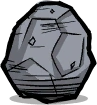

Stone Hatch

You can see what percentage chance a critter has of laying various kinds of eggs by selecting the critter and looking under egg chances. By mousing over the different kinds of eggs it can lay you will see what foods improve the chance of laying them.

You can also find a (partial) list of critters and how foods affect their egg chances on the [wiki](https://oxygennotincluded.fandom.com/wiki/Critter_Morphs).

In the examples above regarding common early critters:

* A hatch becomes more likely to lay stone hatch eggs when fed sedimentary rock.

  + You can find sedimentary rock in the slime biome. (Try to avoid unnecessarily digging up slimelung-infested tiles. Check the germ overlay: icon in top right or press F9.)
* A drecko becomes more likely to lay glossy drecko eggs when fed mealwood.

Smooth Hatch

## EGGS, INCUBATORS AND INCUBATION TIMES

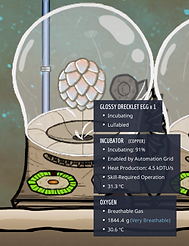

Incubator with egg. The egg has the Lullabied buff, and is at 91% incubation. (The green circle in the bottom left shows the incubation percentage.)

It takes a while for an egg to hatch. During this time, the egg is listed as incubating.

You can select an egg to see how far along it is; its incubation percentage is listed under condition. You can also see how quickly (or slowly) its incubation percentage goes up - how many percent per cycle.

You can speed up the incubation process considerably with the help of an Incubator. An egg in an incubator can be sung to (by a dupe with the ranching skill). This will give the egg a "Lullabied" buff that raises its incubation percentage significantly for that cycle.

I'm not sure if the percentages differ between critters (I don't think they do), but at least for hatches and dreckos:

* A lullabied egg will get a +20% incubation, compared with just 5% incubation per cycle for an egg without the lullabied buff.

Meaning, where a normal egg will take 20 cycles to hatch, an egg with a constant lullabied buff will hatch in just 5 cycles.

The buff lasts one cycle, so to maximize how quickly an egg hatches they need to be lullabied every cycle. You can see if an egg has the lullabied buff by mousing over it. It will have a bullet point that says incubating, and if lullabied it will have a second bullet point that says lullabied.

That was the good news. The bad news is that the incubator is a power-hungry little thing: it requires 240W. But there is good news with the bad: the incubator only needs to be powered while a dupe lullabies the egg. After that you can power it down and the buff will still remain. Then, once you need to lullaby it again, you will once again need to (briefly) power up the incubator.

What this means is that you can save a lot of power by just turning the incubator on long enough to have a dupe lullaby it, and then turn off the incubator again. The buff lasts for a cycle, after which you again turn on the incubator long enough for a dupe to sing to it again.

You can use some simple automation to turn incubators on and off. For instance by building a Signal Switch (found under Automation) and using automation wire to connect it to the incubator's automation port. Then you can simply flip the switch to turn the incubator on and off. Automation is covered [later in the guide](getting-started-with-automation.md).

Or, if automation seems intimidating, you can just use the Disconnect tool (bottom right, looks like a pair of scissors) to disconnect the incubator's power wire, then reconnect it when you want to power it again.

If you want to save on refined metal you can use the same incubator to lullaby multiple eggs. Removing and replace eggs in the incubator as necessary.

Incubation

## USING PIPS TO PLANT STUFF

One of the bonus features of ranching is being able to use a nifty feature pips have: planting wild plants.

Just like tame and wild critters differ, dupe-planted (or "domesticated") plants and wild plants are also different. Wild plants grow more slowly, but don't require any fertilizing.

Pips

Pip

For instance, a domesticated mealwood takes three cycles to grow. During those three cycles it requires 10kg of dirt each cycle. A wild mealwood plant takes a lot longer to grow - 12 cycles. But it doesn't require any dirt.

Pips are unique in that they will pick up seeds and plant them. If a dupe plants a seed the resulting plant will be domesticated. But a seed planted by a pip will grow a wild plant.

(As long as the pip doesn't plant the seed in a farm tile or hydroponic tile. Such plants are considered domesticated even when planted by a pip.)

This means you can use pips to create farms of wild plants; slower growing but which won't require any fertilizing. (The conditions for the plant - air pressure, temperature, etc. - still need to be met.)

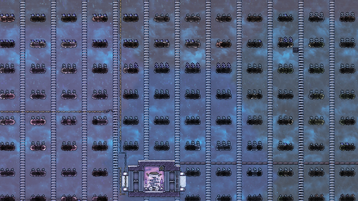

Natural sleet wheat farm. Creating lots of natural tiles and getting your pips to plant lots of seeds is a hassle. But the result is free resources.

Pips follow specific rules regarding planting. These rules have been clearly and concisely documented in a post by Nakomaru on Klei's forums. It's a wonderful guide and is what I turn to whenever I need to remember how the heck pip planting works again.

See: [Pip Planting: Everything You Need to Know](https://forums.kleientertainment.com/forums/topic/110299-pip-planting-everything-you-need-to-know/)

There are useful tools available online for planning farms. I use (and recommend) Oni Assistant and Professor Oakshell's Lab.

* Oni Assistant: oni-assistant.com
* Professor Oakshell's Lab: zari.rtk0.net/ProfessorOakshell/index.html

Both sites have calculators for working out how much of various resources (like plants and critters) you need in order to produce your target amount of calories per cycle.

Both calculators have a lot of options, but don't worry - you can figure them out. Let's take a closer look at [The Oni-assistant food calculator](https://oni-assistant.com/tools/foodcalculator)

There are a lot of options in the food calculator. The basics are:

* Input how many dupes you have

  + There are two separate inputs for this: one for how many "standard" dupes you have and one for how many you have with the "bottomless stomach" trait.
* Choose what you will be feeding your dupes
* Select whether the plants are are wild (otherwise they are considered domesticated)

  + (The option for "Dupe harvest" means if dupes will harvest them. Otherwise plants auto-harvest themselves after - if I remember correctly - 4 cycles.)

Then the site will calculate how many of each plant (or other food-related resource) you need. (Professor Oakshell's Lab works in a very similar way.)

The pip planting guide and oni-assistant or Professor Oakshell's Lab are a great combo when planning (and planting) natural farms.

(Regarding creating natural tiles, if and when you need  to do that. I use 10kg of algae per tile. Set a storage bin to algae and 10 kg. Then deconstruct the storage bin and remove all but the algae. Then I have a glass forge output hot glass on the tile.)

That's about it - time to get ranching!

Finally, in case you're hesitant to get started, I'll go over some options for basic ranching setups.

## EXAMPLE RANCH: HATCHES

Where to put buildings is a personal preference - I tend to place them so that I can fit some decor items around the grooming station.

Hatch ex.

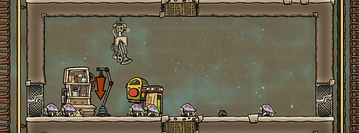

Basic hatch ranch. (The arrow on the right of the grooming station is an older version of the Critter Drop-Off.)

An auto-sweeper is in no way a necessity, but it will save you some time - dupes fill the storage bin and the auto-sweeper fills the critter feeder.

When I get around to decor, I will add metal statues in the one-tile spaces to the right and left of the grooming station and two paintings above it, to the left of the auto-sweeper.

Once I get glass or diamond I will swap the walls for windows to let the decor shine out to the fire pole and ladder. (This isn't at all necessary. But, rebel that I am, I do it anyway.)

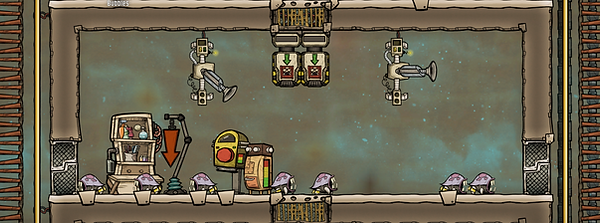

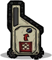

Conveyor receptacle

You can add some more automation by adding a second auto-sweeper and some conveyor loaders. (In the picture above, both auto-sweepers can reach both conveyor loaders.)

The conveyor loaders can send your meat to your kitchen, egg shells to your rock crusher, coal to your coal generators, the "wrong" kinds of eggs (morphs) to wherever you want them, etc.

(If you want to automate the ranch further - not covered in this guide - you can also send your critter eggs to an evolution chamber or hatchery.)

This isn't pictured above, but you can save even more dupe time by having whatever you feed your critters be sent along a conveyor rail to a conveyor receptacle in your ranch. Then your auto-sweeper can fill your critter feeder from the receptacle.

This can save time particularly if you have many ranches - you can have dupes fill one storage bin that then feeds a conveyor loader that sends material to many ranches, supplying food to all the critter feeders in them.

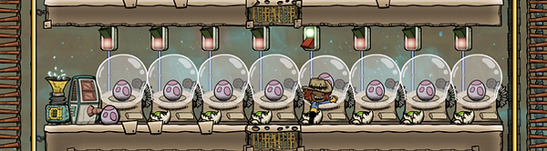

Moar meat! This picture is from an achievement run. One of the achievements ("Carnivoire") requires eating 400K calories of meat during the first 100 cycles. The setup in the picture is used first to fill hatch ranches and then (gruesomely enough) to quickly hatch meat for dinner.

The tricky part about ranching is automating keeping your ranches at a steady, optimal critter amount per ranch. I almost never bother with this, as it's mainly important when you are ranching for meat (or eggs).

I tend to ranch for the materials provided by critters (like reed fiber or plastic). So I just let my ranches overfill. Critters get the "cramped" debuff, but only once I already have a full ranch. Which is good enough for me.

## EXAMPLE RANCH: DRECKOS

There are two kinds of dreckos: standard dreckos (which are white) and glossy dreckos (which are blue).

Both kinds of drecko are useful. Dreckos drop reed fiber when sheared, glossy dreckos drop plastic.

Morphing dreckos into glossy dreckos is done by feeding them mealwood. This topic, including pictures of a basic ranch for morphing dreckos into glossy dreckos, is covered [later in the quide](low-tech-plastic-drecko-ranching.md).

Drecko ex.

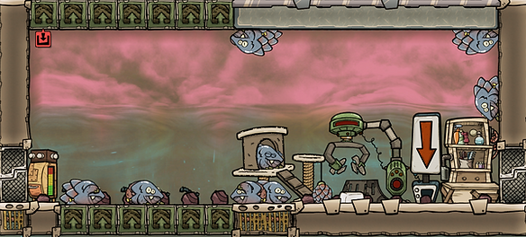

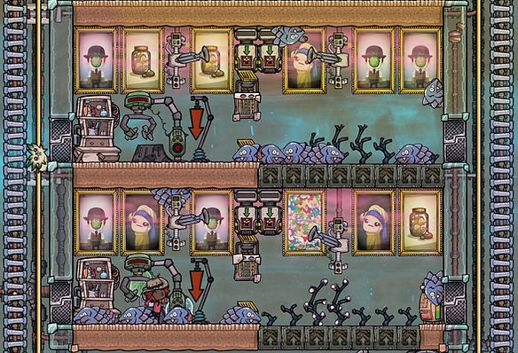

Plastic ranch. Various stages in my standard setup for plastic ranches. The little castle in the top middle is a Critter Condo. It isn't essential, but boosts critter happiness.

Balm lily

White dreckos can eat Balm Lily.

Balm lily is a very low-maintenance food source. It needs to be in chlorine to grow, but doesn't consume any chlorine. The downside is that it has a rather high temperature requirement: between +35C and +85C.

By building a drecko ranch using balm lily as food, you can create an infinite supply of meat, reed fiber, egg shells and phosphorite.

Dreckos need hydrogen for their scales to regrow after being sheared. So if you build such a ranch, it's a good idea to have hydrogen above (for scale regrowth) and chlorine below (for the balm lilies to grow).

It is also a good idea to have anyone entering the ranch wear a kind of protective clothing called an atmo suit. That way they will be able to breathe even when surrounded by chlorine. Also, the carbon dioxide dupes exhale would mess with the chlorine. With an atmo suit, that carbon dioxide is stored in the suit and then dumped outside the ranch. ([Atmo suit basics](atmo-suit-basics.md) are covered later in the guide.)

I use transport tubes for my balm lily drecko ranches. They can be quite heavy power users. Another option would be to use [liquid locks](liquid-lock-basics.md) by the ranch entrances. (And a door to keep the dreckos in.)

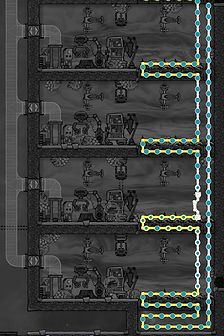

Heating. Usually you will build cooling loops. For this, you'll actually need a heating loop. A thermo sensor makes the liquid tepidizer kick in to make sure the balm lilies stay happy.

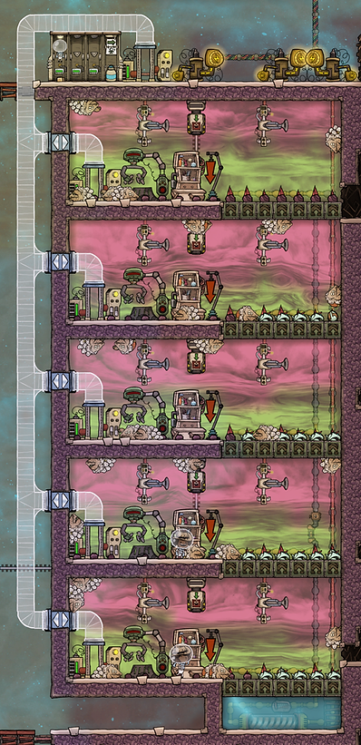

Free stuff! This setup only uses power and dupe time. It is a bit of a bother to build, but once done you will have an endless supply of free goodies.

And, finally: an option to be aware of is that you don't need to tame your dreckos for their scales to grow. Wild dreckos eat less than tame ones, so you can get by with less food. However, their scales then also take longer to grow.

Getting hold of a significant amount of wild glossy dreckos requires a bit of doing, but regular dreckos are common. Dreckos as well as drecko eggs also have a chance of appearing as care packages from the printing pod.

Spoiler(ish) alert. To get hold of more wild glossy dreckos, you can activate a machine you will come across during your exploration, called the Critter Flux-o-Matic.

You activate the Flux-o-Matic by having five critters pass through it. (You deliver the critters to the room, they pass through the machine on their own.) Once the Flux-o-Matic is active, any regular dreckos that pass through will morph into glossy dreckos.

\*) "Old-timer reminiscing" alert

Regarding why ranching used to be a necessity... Back in the day, egg shells were the only way to get lime. Lime is needed for steel, which in turn is needed to make bunker doors and tiles - the only tiles that can withstand meteor showers.

The reason that mattered was that the second you started a new game, meteors would start pummeling their way through the surface, slowly digging their way down to your base.

So every new game began with a race against time to get enough lime to make enough steel to save your base - and the biomes and resources above it - from destruction.

(I would say "Fun times," but they weren't really. I considered it the most tedious part of starting a new game. But, like with how slimelung used to actually be dangerous, the Ticking Clock of Meteor Doom served the important purpose of giving Oxygen Not Included old-timers the opportunity for some "When I was your age..." moaning and groaning.)

Old-timer-alert

---

*Archived from [https://www.guidesnotincluded.com/ranching-basics](https://www.guidesnotincluded.com/ranching-basics) ([Wayback Machine snapshot](https://web.archive.org/web/20250826150351id_/https://www.guidesnotincluded.com/ranching-basics)). Original work © Some Random Finn / guidesnotincluded.com, licensed [CC BY-NC-SA 4.0](https://creativecommons.org/licenses/by-nc-sa/4.0/). Reformatted from HTML to Markdown for this non-commercial community archive — see [Attribution & licensing](attribution.md).*
