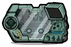
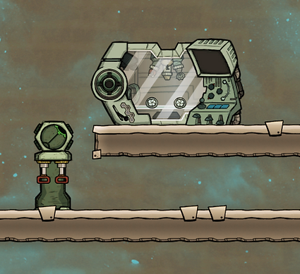
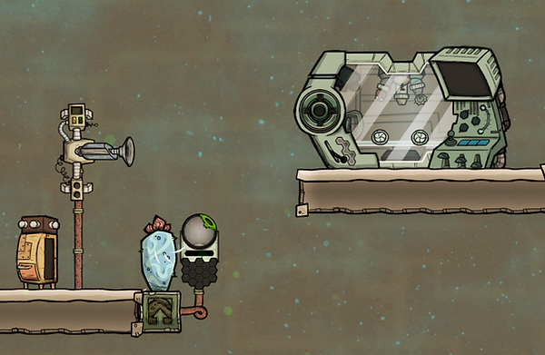
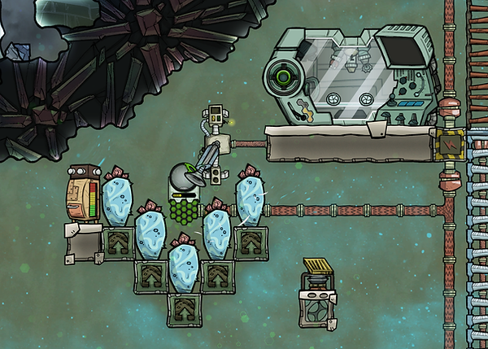
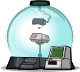
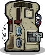

## Introduction

There is a bunch of useful stuff in the research tree that is locked behind the third and fourth kinds of research. (The first two kinds are covered [earlier in this guide](the-very-early-game.md).)

For the third kind of research you will need Data Banks, which in turn means you will have to send a dupe (and some plastic) into orbit. (Don't worry - you get the dupe back.) For the fourth kind of research you will need to generate radbolts.

You will probably need the fourth kind of research before the third kind, so let's be confusing and look at them in reverse order.

## Applied Sciences Research (the one with the radbolts)

Materials Study Terminal. Aim radbolts at the circle on the left.

Manual Radbolt Generator

Radbolt Generator

Spaced Out introduces radiation into the game. You can see radiation levels with the radiation overlay (the radiation image top right).

The fourth kind of research is called Applied Sciences Research. It's the one with the orange icon in the research tree.

The way you conduct applied sciences research is by shooting radbolts into a Materials Study Terminal (a kind of research station). This generates the points used for research. The research is then conducted on the materials study terminal (the same one you shoot the radbolts into).

There are two ways to generate radbolts:

* A Manual Radbolt Generator uses Uranium Ore and dupe labour to generate radbolts
* A Radbolt Generator gathers radiation from its surroundings to generate radbolts

Note: both generators let you decide what direction you want them to shoot the radbolts.

Another note: shooting radbolts into a materials study terminal is a good thing. Shooting them into a dupe is a bad thing. So make sure to check the direction thing mentioned in the previous note.

* A radbolt shot from the radbolt generator will be worth (or contain) 50 radbolt points
* A radbolt shot from the manual generator will be worth (or contain) 5 radbolt points

The materials study terminal can store 100 points worth of radiation. If the materials study terminal is full and you shoot more radbolts at it, they will spin around a bit in the terminal and then continue on in the direction they were heading when entering the machine.

Note: A radbolts rad value decreases slightly as it travels, so the actual value you get out of one radbolt depends on how far it has to travel to get to the research terminal.

Another note: according to the [wiki](https://oxygennotincluded.fandom.com/wiki/Manual_Radbolt_Generator) you can also use enriched uranium ore for the manual radbolt generator, which would generate a radbolt worth 25 rabdolt points.

One way to keep a researching dupe out of harms way when firing radbolts into a materials study terminal is to fire them at an angle. For instance by placing your radbolt generator below and to the left of your materials study terminal. (You can also research a tile that lets radbolts pass through it, making it possible to shoot them from beneath the terminal.)

Diagonal setup. Radbolts won't hit the dupe doing research. (But be mindful of what you have above and to the right of the terminal.)

If you are using a manual radbolt generator then you will need Uranium Ore to generate radbolts. (Some maps have it, if yours doesn't you can check the planet you can teleport to.)

Digging up a few tiles of uranium ore is enough if you just want to get some of the early things researched. Once dug up, uranium ore is rad-free and fine for dupes to handle. (And even before you dig it up it only emits small amounts of radiation.)

You can of course research lots of stuff with the manual radbolt generator if you want, it just ties up a dupe and uses uranium ore. I usually do lots of the early research on the manual generator (partly because the more advanced setup needs a lot of power and partly because setting it up takes a while and I'm lazy.) I switch over the the radbolt generator at the latest when research starts requiring hundreds of points per unlock.

If you will be using a radbolt generator (not the manual one) then you need to place it in an area with a lot of rads. Or, more likely, you will place a lot of rads around your radbolt generator - commonly with the help of one or several Wheezeworts.

Wheezewort and radbolt generator. More wheezeworts produce more radiation. So stick in some extras if you have them.

I use us a design like this. (Note: Oops - the auto-sweeper can't reach the wheezewort on the bottom. So if you use something like this, modify it a bit. Have a second auto-sweeper below and place the phosphorite storage bin so both auto-sweepers can reach it. Or have a way for dupes to fertilize the bottom wheezewort. Or move the auto-sweeper to below the farm tiles.)

Wheezeworts need to be fertilized with phosphorite. You can find it in the hot, purple (aka caustic) biome. Also, Dreckos and [Glossy Dreckos](low-tech-plastic-drecko-ranching.md) drop phosphorite.

Wheezeworts produce a lot of radiation. A lot of Wheezeworts produce a lot of a lot of radiation. You can save your dupes a bunch of radiation exposure by setting up a storage bin and an auto-sweeper so the auto-sweeper handles the fertilization. (I need to check this but I think phosphorite is under "agriculture" in the storage bin selection list.)

When planning your layout, keep in mind that it is the lower, green part of the radbolt generator that collects rads. Also, particularly if you are manually fertilizing the wheezeworts, make sure dupes can't be hit by radbolts.

A radbolt generator will generate 1/10th of the rads in its surroundings. (So 1000 rads per cycle would generate 100 radbolt points per cycle.)

A final note: The radbolt generator is a power-hungry little thing (480W). If there are brownouts - if you run out of power - it begins losing its radiation charge. So put some thought into power and how you will make sure you have a steady supply when setting up this research build.

(And, if all of this seems a bit much to deal with, you can always use the manual generator until you feel ready to go for a wheezewort setup.)

## Interstellar Research (the one with the data banks)

Virtual Planetarium

Data Bank

Orbital Collection Lab

Interstellar research is conducted in a Virtual Planetarium using Data Banks.

You will come across some data banks on your map. Whenever you find a structure of any kind, click on it and see if you can examine it. Often you can, and it will result in some data banks. Analyzing geysers and the like also gives some data banks.

The data banks you come across won't be anywhere near enough to unlock the entire research tree. To get additional data banks you will need an Orbital Collection Lab.

The orbital collection lab uses dupe labour and plastic to generate data banks. However, you can only operate orbital collection labs when in space. Blasting off and heading one tile in any direction is enough.

([Getting to space](getting-to-space-dlc.md) is covered later in the guide.)

Use of the orbital collection lab is affected by the machinery skill. But its use is not locked behind any particular skill - any dupe can use it.

To unlock the entire research tree you will need a lot of plastic - upwards of 10K. So give some thought to your plastic production. (Later in this guide we'll cover the low-tech option of [ranching Glossy Dreckos](low-tech-plastic-drecko-ranching.md) and also [refining petroleum](getting-oil-petroleum-and-plastic.md).)

---

*Archived from [https://www.guidesnotincluded.com/spaced-out-research-guide](https://www.guidesnotincluded.com/spaced-out-research-guide) ([Wayback Machine snapshot](https://web.archive.org/web/20250720063052id_/https://www.guidesnotincluded.com/spaced-out-research-guide)). Original work © Some Random Finn / guidesnotincluded.com, licensed [CC BY-NC-SA 4.0](https://creativecommons.org/licenses/by-nc-sa/4.0/). Reformatted from HTML to Markdown for this non-commercial community archive — see [Attribution & licensing](attribution.md).*
